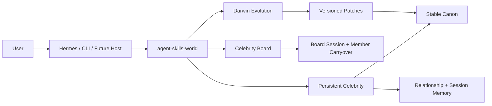
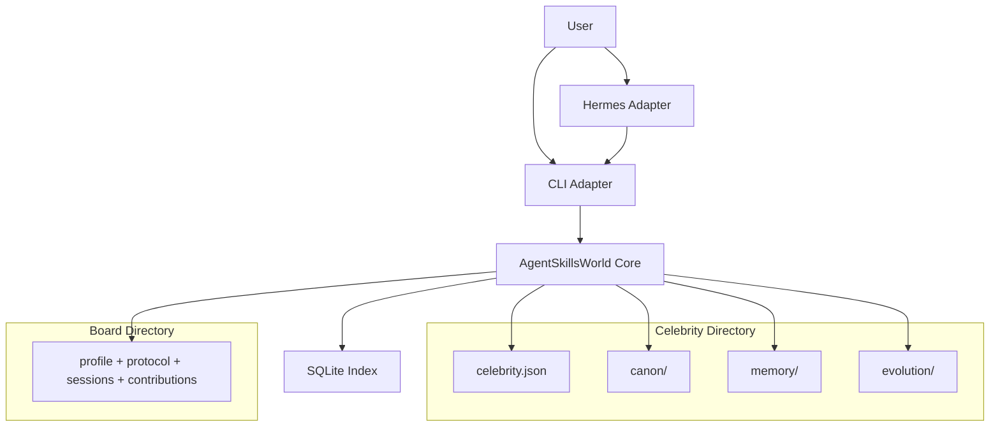

# agent-skills-world

TypeScript runtime for persistent celebrity skills, single-celebrity dialogue, and multi-celebrity advisory boards:

- `Nuwa` creates the initial celebrity directory and canon
- `Hermes` acts as an adapter that writes session memory and relationship memory
- `Darwin` extracts, evaluates, and promotes safe changes
- `Progressive loader` loads only the minimum skill slices needed for the current query

## Why this repo exists

The primary object is the `celebrity directory`, not a simulated society.

Each celebrity lives under `world/celebrities/<slug>/` with:

- `canon/` for stable identity
- `memory/` for episodic, relationship, and board memory
- `evolution/` for Darwin candidates, experiments, and patches
- `celebrity.json` for progressive loading rules

The repo is organized as:

- `src/core/`: the celebrity world engine, markdown memory logic, SQLite index, and progressive loader
- `src/adapters/cli/`: CLI adapter over the core engine
- `src/cli.ts`: stable compatibility entrypoint for local scripts and Hermes
- `src/lib/`: temporary compatibility re-exports while callers migrate to `src/core/`

Detailed diagrams live in [docs/ARCHITECTURE.md](/Users/admin/Documents/GitHub/agent-skills-world/docs/ARCHITECTURE.md).

## Quick start

```bash
npm install
npm run bootstrap

npm run world -- chat log-turn \
  --slug darwin \
  --user-id user_001 \
  --session-id sess_001 \
  --user-message "How should a celebrity skill evolve without drifting?" \
  --assistant-message "Only repeated evidence across sessions should pressure canon."

npm run world -- chat finalize \
  --slug darwin \
  --user-id user_001 \
  --session-id sess_001

npm run world -- context load \
  --slug darwin \
  --user-id user_001 \
  --query "How should memory update without rewriting identity?"

npm run world -- evolution list --slug darwin

npm run world -- celebrity generate \
  --name "Ada Lovelace" \
  --domains "mathematics,computing,systems" \
  --traits "compresses abstractions into mechanisms" \
  --works "Notes on the Analytical Engine"

npm run world -- board create \
  --board-id genius-board \
  --members "darwin,ada-lovelace" \
  --purpose "Cross-era advisory board for durable AI skill design"

npm run world -- board convene \
  --board-id genius-board \
  --session-id board_001 \
  --user-id user_001 \
  --query "How should a persistent celebrity skill evolve without losing identity?"

npm run world -- board finalize \
  --board-id genius-board \
  --session-id board_001 \
  --user-id user_001 \
  --query "How should a persistent celebrity skill evolve without losing identity?" \
  --synthesis "Keep canon stable, let memory accumulate, and let Darwin promote only repeated evidence."
```

## World layout

```text
world/
├── celebrities/
│   └── darwin/
│       ├── celebrity.json
│       ├── canon/
│       ├── memory/
│       └── evolution/
├── boards/
└── world.sqlite
```

## Runtime layering

`agent-skills-world` is the system of record.

- `Nuwa` bootstraps a celebrity's canon into markdown
- `Hermes` is not the center of the system; it is a host adapter that calls the CLI
- `Darwin` reads archived evidence and proposes or promotes safe patches
- Markdown files remain the truth source, while SQLite is a fast local index

## Product Overview



## Current Product Surface

The latest host experience built on top of this engine is a cinematic interface
called `名人世界`.

- `Immersive landing page`: a starfield portal frames the experience as entering
  a world of cross-era minds instead of opening a plain chat box.
- `Celebrity constellation`: users browse floating celebrity cards across
  philosophy, physics, chemistry, strategy, education, innovation, and
  art-science.
- `Single-celebrity dialogue`: selecting one celebrity opens a dedicated chat
  thread with persistent identity, voice, and relationship memory.
- `Multi-select board mode`: users can choose several celebrities at once and
  assemble a `智囊团` before asking a question.
- `Board consultation`: the board opens as one shared room with a synthesized
  kickoff while preserving each member's own canon, board role, and carryover
  memory.

This matters because the repo is no longer best explained as just a CLI. It now
cleanly supports a product surface where one user can:

- talk to one historical expert in a persistent 1:1 session
- assemble several experts into a board for comparative advice
- carry session evidence back into memory and Darwin evolution after the chat

## UI to Runtime Mapping

The front-end flow shown above maps directly onto the world engine primitives in
this repo:

- `Enter World` / choose a celebrity: host calls `context load` to assemble the
  minimum canon and memory slices needed for the prompt.
- `Ask a celebrity`: host appends each exchange with `chat log-turn`, then
  persists summaries, relationship memory, and Darwin candidates through
  `chat finalize`.
- `Select multiple celebrities`: host creates or reuses a board whose members
  live under `world/boards/<boardId>/`.
- `Start consultation`: host calls `board convene` to assemble member contexts
  into one board prompt block.
- `Finish board consultation`: host calls `board finalize` to write board
  synthesis, member contributions, and per-member board memory carryover.
- `Long-term improvement`: Darwin evaluates repeated evidence and promotes safe
  canon patches without letting one chat rewrite identity inline.

## Core Diagram



## Commands

- `bootstrap`: create `world/` plus a sample Darwin celebrity
- `celebrity create`: create a new celebrity directory
- `celebrity generate`: scaffold a richer celebrity canon from a lightweight seed
- `board create`: create an advisory board
- `board convene`: assemble progressive contexts for all board members into one meeting prompt
- `board finalize`: persist board synthesis and sync member-specific board memory
- `chat log-turn`: append an episodic turn
- `chat finalize`: create summaries and Darwin candidates
- `context load`: progressively load the minimum skill slices for a query
- `memory search`: FTS search against celebrity docs
- `evolution list|evaluate|promote`: Darwin workflow

## Hermes integration

`hermes-agent` has a bridge provider at
`plugins/memory/celebrity_world/`.

That provider is intentionally just an adapter layer. It shells into this
repo's CLI for:

- progressive context loading
- per-turn memory sync
- end-of-session Darwin extraction

Use it like this:

1. Build this repo once:

```bash
npm install
npm run build
npm run bootstrap
```

2. In Hermes, set:

```yaml
memory:
  provider: celebrity_world
```

3. Create `$HERMES_HOME/celebrity_world.json`:

```json
{
  "world_root": "/Users/admin/Documents/GitHub/agent-skills-world",
  "celebrity_slug": "{agent_identity}",
  "cli_mode": "dist"
}
```

If your Hermes profile is named `darwin`, the provider will map it to
`world/celebrities/darwin/` and use progressive loading on each turn.
