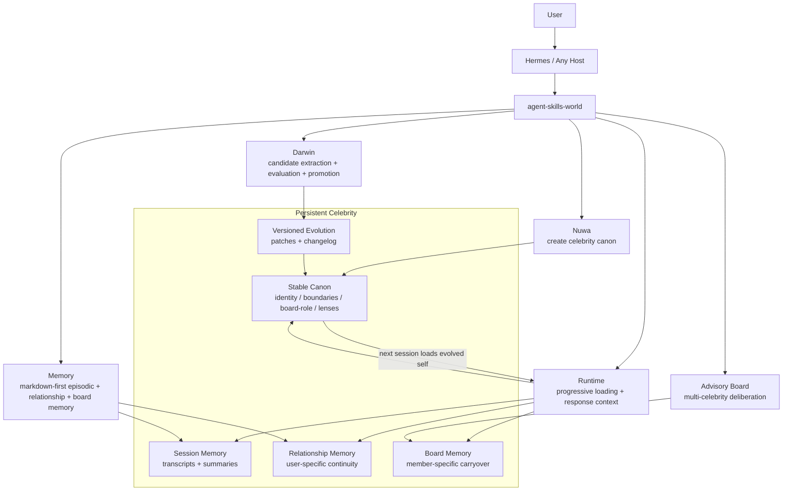
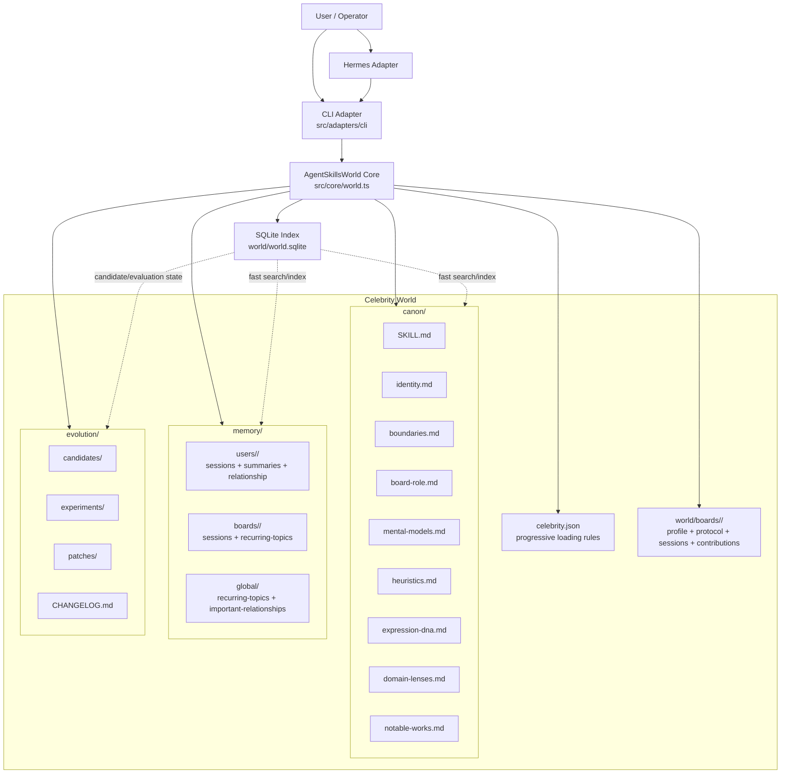
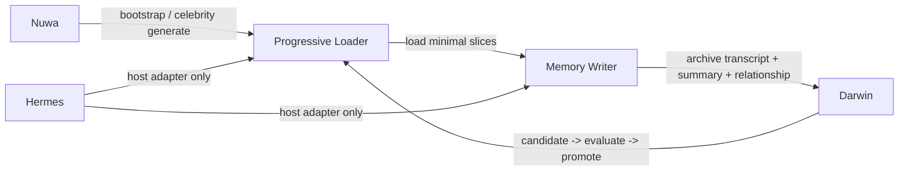
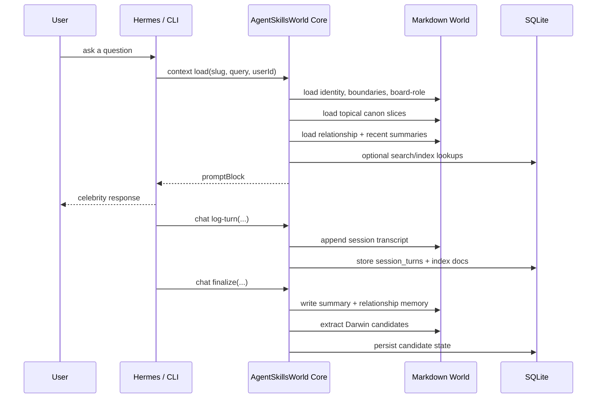
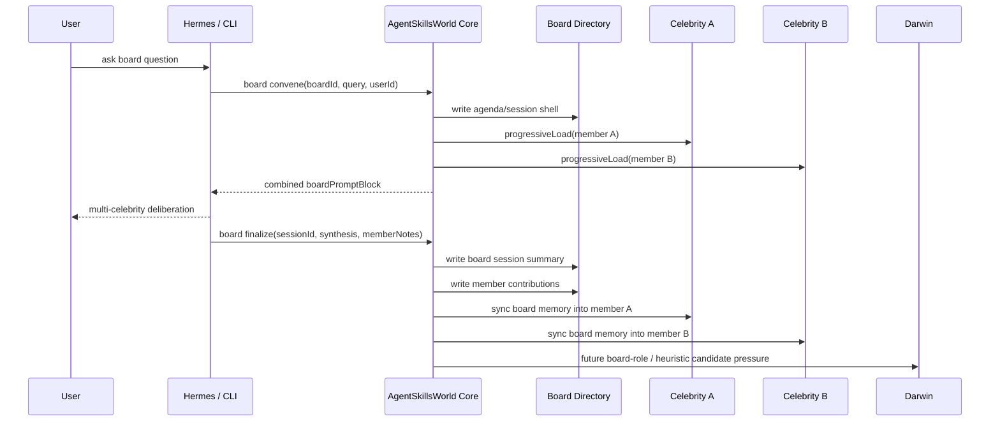

# Architecture

`agent-skills-world` is built around one primary object: the persistent
celebrity directory.

It is not a society simulator and it is not a Hermes plugin-first design.
Hermes is only a runtime adapter. The real source of truth remains the
markdown world plus the TypeScript core that manages loading, memory, and
Darwin-style evolution.

## Product Overview

## Core Design

## Runtime Layers

## Single Celebrity Turn

## Board Flow

## Design Invariants

- `Markdown first`: canon, memory, board memory, and Darwin artifacts remain
  inspectable files.
- `SQLite second`: SQLite is an index and query accelerator, not the canonical
  store.
- `Progressive loading`: never load every celebrity file by default.
- `Darwin gate`: chats create evidence and candidate patches, but do not
  directly rewrite canon.
- `Board memory split`: board-level session memory and per-member board memory
  are stored separately to avoid cross-contamination.
- `Hermes is an adapter`: the world engine stays independent of the runtime
  host.

## What This Means Product-Wise

- `Any celebrity can persist`: each celebrity is a durable directory, not a
  temporary prompt.
- `Any celebrity can evolve`: post-chat evidence creates Darwin candidates
  instead of rewriting canon inline.
- `Any celebrity can join a board`: board memory is shared at the board level
  and also carried back into each member's own memory.
- `Any runtime can host it`: Hermes is one adapter today, but the core world
  engine stays reusable for CLI, HTTP, or future hosts.
